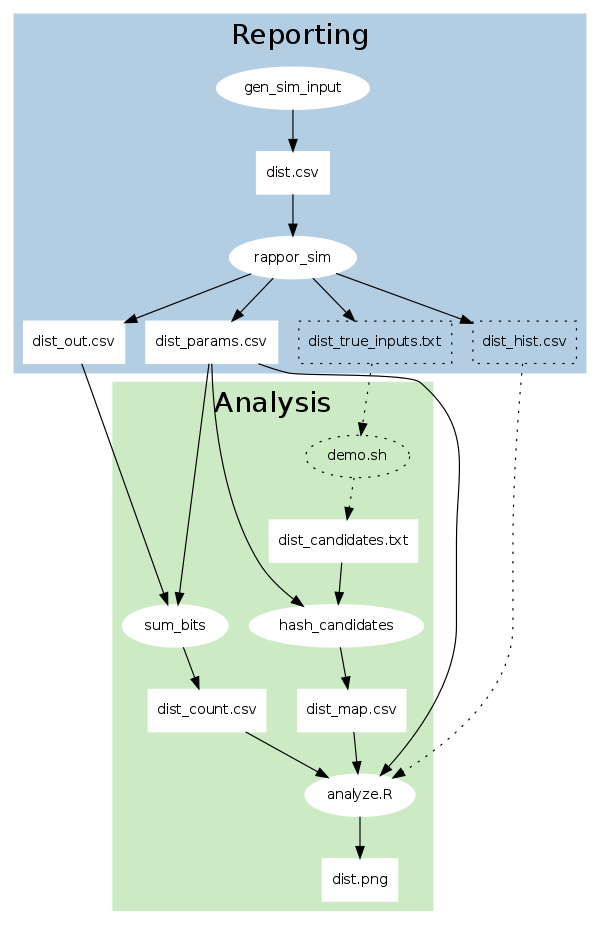

RAPPOR Data Flow
================

This doc explains the simulation tools and data formats in the [RAPPOR
repository](https://github.com/google/rappor).  We'll focus on the code, and
describe the algorithm only informally.  For details, see the [paper][].

Overview
--------

Start with this command:

    $ ./demo.sh run

It takes a minute or so to run.  The dependencies listed in the
[README][] must be installed.  At the end, it will say:

    Wrote _tmp/report.html.  Open this in your browser.

It should look like [this][example].

The following diagram shows what processes and files are involved in the demo.
Ovals represent **processes**; rectangles represent **data**.  The dotted lines
denote components that are involved in the simulation, but wouldn't be used in
a "real" setting.

In most configurations, reporting (in blue) is done by client machines, while
analysis (in green) is done by a server.

In the simulation, reporting consists of these steps:

  1. Generate simulated input data with different distributions.
  2. Obscure each value with the RAPPOR privacy-preserving reporting mechanism.

Analysis consists of these steps:

  1. Aggregate the reports by summing bits (i.e. make a counting Bloom filter)
  2. Come up with candidate strings, and hash them in the same manner as the
  client.
  3. Using the reports, RAPPOR parameters, and candidate strings as input,
  infer the distribution of true values.  We don't see the values themselves.
  We plot the true and inferred distributions side by side for comparison.

This process is described in detail below.

1. Generating Simulated Input
-----------------------------

The `tests/gen_sim_input.py` tool generates CSV data, like this:

<!-- TODO: a realistic data set would be nice? How could we generate one?  -->

**exp.csv**

    client, true_value
    1,      v6
    1,      v3
    1,      v3
    1,      v5
    1,      v13
    1,      v1
    1,      v8
    2,      v2
    2,      v3
    2,      v1
    2,      v8
    2,      v1
    2,      v30
    2,      v10
    3,      v4
    ...

*(spaces added for clarity)*

By default we generate 700,000 rows: 7 random values from `v1` to `v50` for
each client.  These can be thought of as a variable being reported over time.

We're simulating an environment where there are many RAPPOR clients, and a
single server does the RAPPOR analysis on the accumulated data.

The `client` is represented by an integer ID.  The `true_value` should **not**
be sent over the network because we wish to preserve the client's privacy.

2. RAPPOR Reporting
-------------------

The `tests/rappor_sim.py` tool uses the Python client library
(`client/python/rappor.py`) to obscure the `v1` .. `vN` strings.  We want to
infer the distribution of these strings over the entire population, but we
don't want to know any individual values.

After the RAPPOR transformation, we get another CSV file with 700,000 rows.
Each client is assigned a cohort.

**exp_out.csv**

    client, cohort, rappor
    1,      63,     1111101011110111
    1,      15,     1110110011111100
    1,      12,     0110101111100101
    1,       0,     1111100111110111
    1,       3,     1001110111110011
    1,      14,     1011111010110011
    1,      33,     0111010100101011
    2,      40,     0011011010101001
    2,      35,     1010110101110100
    2,      58,     1110110110111110
    2,      38,     0010001111001010
    2,       5,     1110111011100101
    2,      36,     0111010100111111
    2,      39,     0101101000101101
    3,      32,     0011100111111110
    ...

*(spaces added for clarity)*

We also get a one-row CSV file that contains the RAPPOR parameters:

**exp_params.csv**

    k,h,m,p,q,f
    16,2,64,0.5,0.75,0.5

These are described in the [paper][]. The parameters that the clients use
must be known to the server, or the decoding will fail.  In addition, all
clients must use the same parameters for a given variable.

The `rappor_sim.py` process also writes these files:

- `exp_hist.csv`: The true histogram of input values.  This is used only for
  comparison.  In the real world you obviously won't have this.
- `exp_true_inputs.txt`: A list of the unique values reported, e.g. `v1` ..
  `v50`.  You won't have this either, in general.  To use RAPPOR, you must
  supply *candidate strings*, described below.

3. Report Aggregation
---------------------

`sum_bits.py` takes the `exp_out.csv` output, and produces the "counts" file:

**exp_counts.csv**

    11116,6273,6433,6347,6385,6290,6621,6359,6747,6623,6321,6696,6282,6652,6368,6286,6222
    10861,6365,6263,6170,6258,6107,6633,6171,6226,6123,6286,6254,6408,6182,6442,6195,6187
    ...

The file has 64 rows, because the simulation has 64 cohorts by default (`m =
64`).  This parameter should be adjusted based on the number of unique true
values expected.  <!-- TODO: more detail -->

There are 17 columns.  The left-most column is the total number of reports in
the cohort.  The remaining 16 columns correspond to the `k = 16` bits in the
Bloom filter.  Each column contains the number of reports with that bit set
to 1.

So, in general, the "counts" file is a `(k+1) * m` matrix.

4. Candidate Strings
--------------------

In the simulation, we assume that the analyst will come up with a *superset* of
the candidate strings.  This is done in the `more-candidates` /
`print-candidates` functions in `demo.sh`.

You can also test what happens if you omit true strings from the candidates, by
editing the invocation of `print-candidates` in `run-dist`:

    # Example of omitting true values.  Generate candidates from
    # exp_true_inputs.txt, omitting values v1 and v2.

    print-candidates $dist 'v1|v2'  > _tmp/${dist}_candidates.txt

In general, coming up with candidates is an application- or metric-specific
process.

The candidates are hashed by `hash_candidates.py` to create the "map" file,
before being passed to R for analysis.

**exp_map.csv**

    v1,8,13,30,22,37,37,53,53,77,67,89,86,97,97,118,128,139,136,157,<truncated>
    v10,13,2,25,28,42,45,58,60,68,66,91,89,108,102,113,125,130,131,<truncated>

The map file has one row per candidate.  In this case, there are 60 rows: 
50 for the true values and 10 for "fake" values, which make the candidates a
superset of the true input.

The left most column is the raw candidate string.  Then there are 128 more
columns: for `m = 64` cohorts times `k = 2` hash functions in the Bloom filter.

<!-- TODO: more detail about setting params?  Examples of coming up with
candidate strings? -->

5. RAPPOR Analysis
------------------

Once you have the `counts`, `params`, and `map` files, you can pass it to the
`tests/analyze.R` tool, which is a small wrapper around the `analyze/R`
library.

You will get a plot of the true distribution vs. the distribution recovered
with the RAPPOR privacy algorithm.

[View the example output][example].

You can change the simulation parameters and RAPPOR parameters via flags, and
compare the resulting distributions.

For example, if you expect more unique values from clients, you should also use
more cohorts (i.e. raise `m`), to prevent hash function collisions from
degrading the result quality.

<!-- TODO: 
     - how to change flags
     - more detail on what the various parameters do
     - association analysis
     - basic RAPPOR
     - longitudinal privacy
-->

Conclusion
----------

RAPPOR allows you infer statistics about populations while preserving the
privacy of individual clients.  In this doc, we walked through a simple demo.
However, there are other variations of RAPPOR and settings in which you can use
RAPPOR, which we'll write more about.

Feel free to send feedback on this doc to
[rappor-discuss@googlegroups.com](https://groups.google.com/forum/#!forum/rappor-discuss).

[README]: https://github.com/google/rappor/blob/master/README.md
[paper]: http://arxiv.org/abs/1407.6981
[example]: http://google.github.io/rappor/examples/report.html

